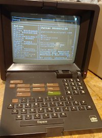

# Minitel v1 + Raspi

[react-blessed](https://github.com/Yomguithereal/react-blessed) + Minitel v1 !!

## Usage

Login : pi (en minuscule)

Shift+ENVOI pour entrée

## Commands :

 - p : list up
 - m : list down
 - q : quit

## Boot

Le fichier `/etc/system.d/system/serial....` démarre agetty

Au login, `/home/pi/.bashrc` est executé et lance `/home/pi/start.sh` lequel configure la console et lance un [screen](https://www.gnu.org/software/screen/) qui lui-même lance `node /home/pi/bl/out.js`.

Cf [scripts](./scripts)

## Dev

 - npm run start
 - npm run build : create `out.js`

## Remote screen

connecté en SSH : `screen -x` permet de rejoindre la session minitel

## Hardware

 - RaspberryPi v3 with Raspbian
 - USB-to-TTL : https://hackspark.fr/fr/pl2303-usb-to-uart-ttl-breakout.html
 - DIN adapter : http://www.stquentin-radio.com/?page=info_produit&info=1539&color=3&id=0&act=0
 - Serial config for my minitel v1 (without FCTN key) : `1200,cs7`

💡 if you use a 5V USB-to-TTL you dont need additionnal circuit between the two connectors.

## Sources

 - termcap configs... : http://canal.chez.com/terminfo.htm et http://canal.chez.com/term_bash.htm ❤️
 - https://chapelierfou.org/2016/06/a-minitel-as-a-linux-terminal/
 - http://pila.fr/wordpress/?p=425
 - http://sta6502.blogspot.fr/2016/02/utiliser-un-minitel-comme-terminal-sur.html?m=1

## Todo

 - affichage caractères spéciaux
